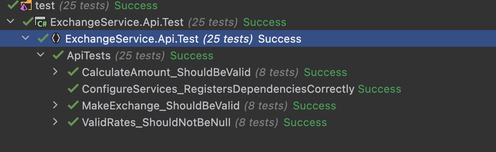

## Problem

In a bid to shift from a monolith to micro-service architecture, the bank has earmarked the currency
exchange functionality as a suitable module to build the first micro-service. The micro-service has to
offer the same functionality that currently exists in the bank’s solution, such as,

- Integrating to a rate provider to obtain the latest currency exchange rates. (Example
  https://fixer.io/ or https://exchangeratesapi.io/)
- Retaining information about currency exchange trades carried out by its clients
- When an exchange rate is used it should never be older than 30 minutes (Bonus question)
- Limiting each client to 10 currency exchange trades per hour (Bonus question)

## Solution

- https://fixer.io/ integration implemented.
- Currency exchange trades are logged in `ExchangeLog` table of `ExchangeDb`
- Exchange rates are stored in cache for 30 minutes
- Each customer can only exchange 10 times per hour (set on appsettings.json `ApplicationSettings:MaxExchangeCount`)

## Technologies

- Docker support
- C# (.NET 6)
- Entity Framework Core
- DB: Postgres (`EnsureCreated called on Program.cs`)
- Caching -> `memory` or `redis` set on `appsettings.json ApplicationSettings:UseRedis`
- Swagger Support
- RESTful APIs
- Unit Tests
- Logging -> Serilog
- FluentValidation
- FluentAssertions

## Running

> docker-compose up -d

- https://localhost:5000

## Test Results
